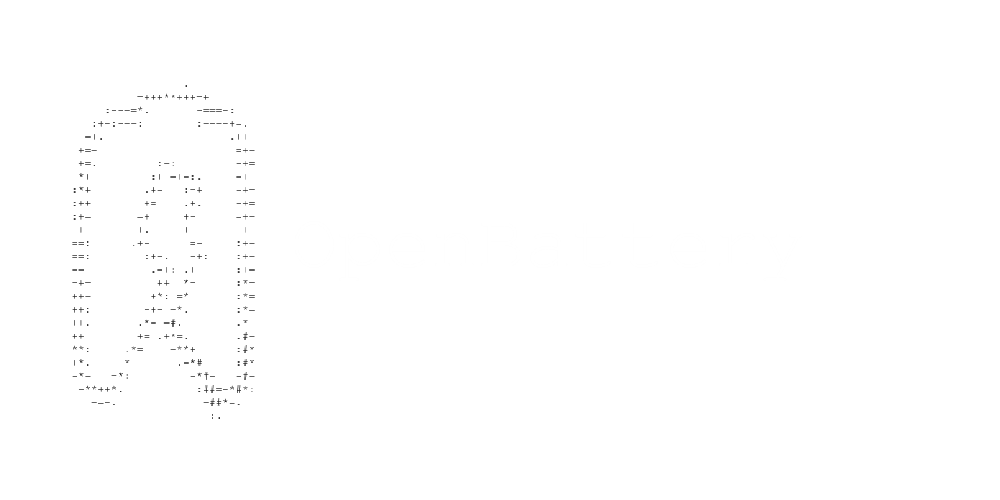

https://img.shields.io/badge/license-GPLv3-red

I started writing OpenBattery source code at the beginning of june 2023.

At first i was looking for a terminal-based battery monitor for my Arch Linux system, not finding one, I decided to make mine, entirely wrote in C and with the less dependencies possible.

At the day of 29/12/2023, OpenBattery's battery -ef command can also display the remaining about of battery's life.

  <a href="https://github.com/ToujoursTitou2/OpenBattery/wiki">Wiki</a>

